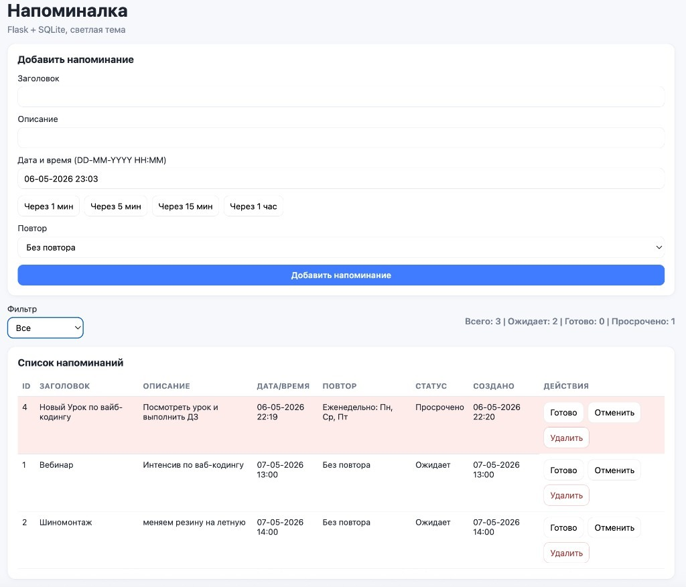

# Napominalka

Современное приложение-напоминалка на Python с SQLite.

Проект содержит две версии интерфейса:

- `flask_app.py` — веб-версия на Flask (рекомендуется), светлая тема, порт `5004`
- `app.py` — desktop-версия на `tkinter`

## Возможности

- Добавление, удаление и изменение статуса напоминаний
- Статусы: `Ожидает`, `Готово`, `Просрочено`, `Отменено`
- Автоматический перевод просроченных напоминаний в `Просрочено`
- Фильтрация по статусам
- Повторяющиеся напоминания:
  - по дням недели
  - по дате (число месяца)
  - каждый месяц
  - каждый год
- Хранение данных в `SQLite3` (`reminders.db`)

## Стек

- Python 3.11+
- Flask
- SQLite3
- tkinter (desktop UI)
- win10toast (Windows-only toast notifications)

## Быстрый старт (Flask)

```bash
python3 -m pip install -r requirements.txt
python3 flask_app.py
```

Открыть в браузере:

- [http://localhost:5004](http://localhost:5004)

## Desktop-версия (tkinter)

```bash
python3 app.py
```

## Скриншот



## Структура

- `db.py` — база данных, миграции схемы, бизнес-логика повторов
- `flask_app.py` — Flask backend и API для due-уведомлений
- `templates/index.html` — шаблон веб-интерфейса
- `static/styles.css` — светлая тема
- `static/app.js` — клиентская логика (поля повтора, уведомления, polling)
- `app.py` — desktop-приложение на tkinter
